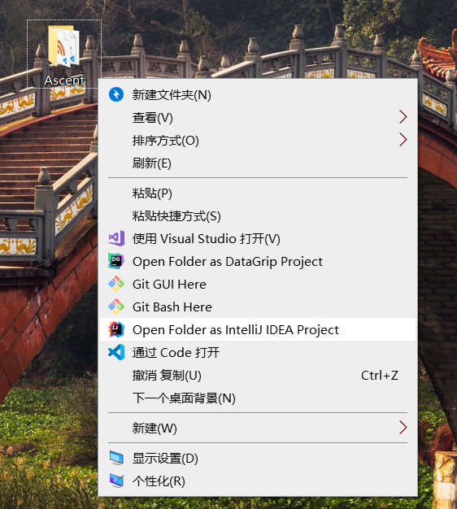

**打开文件夹作为Intellij IDEA项目**

**在本地MySql数据库执行项目中的sql/Shop.sql文件**

**设置本地Mysql数据库的账号和密码**

**maven插件执行tomcat7:run-war**

**用户地址**

`http://localhost:8888/Shop-SSM/shop-user/`

**后台管理**

`http://localhost:8888/Shop-SSM/admin/`

